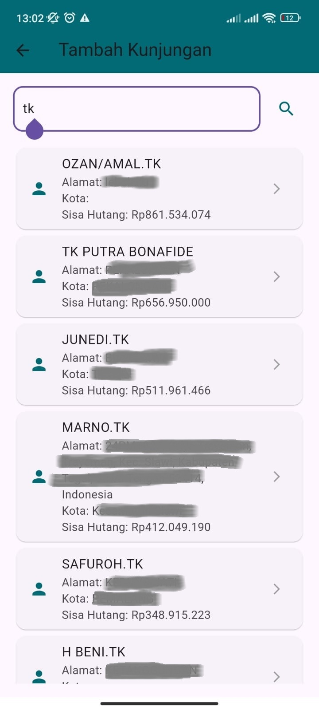
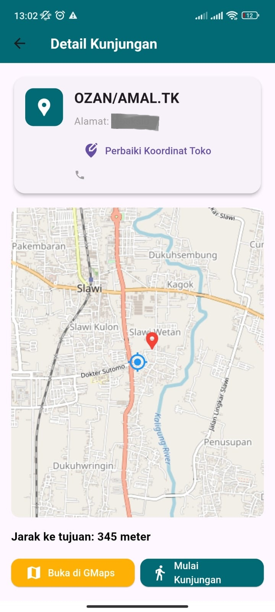
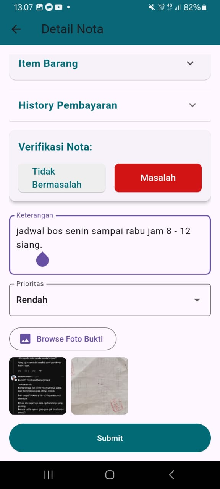

# 📱 Aplikasi Auditor PPJ

Aplikasi mobile untuk memonitor status nota penjualan yang tersebar di pelanggan, mengecek tagihan yang berjalan, dan melaporkan kendala audit secara langsung dari lapangan.

---

## 🔧 Teknologi yang Digunakan

- Flutter
- REST API
- Node.js + Express.js
- SQL Server & MySQL
- JWT (JSON Web Token)
- CORS

---

## ✨ Fitur Utama

- ✅ Menampilkan daftar nota pelanggan yang overdue dan butuh dikunjungi
- ✅ Menampilkan peta lokasi pelanggan (Google Maps)
- ✅ Presensi di lokasi pelanggan dengan akurasi maksimal 50 meter (geofence)
- ✅ Audit nota dengan laporan lengkap + upload bukti foto
- ✅ Menampilkan total nota yang sudah dan belum diaudit

---

## 👨‍💻 Peran Saya

**Fullstack Developer**  
Frontend: Flutter  
Backend: Node.js + Express.js  
Database: SQL Server & MySQL

---

## 🚧 Tantangan & Solusi

**Tantangan:**  
Banyak auditor bekerja di area yang tidak memiliki sinyal internet stabil.

**Solusi:**  
Menggunakan sistem local database + background sync berbasis queue, sehingga proses audit tetap bisa dilakukan offline dan data akan tersinkron saat koneksi kembali tersedia.

---

## 📷 Screenshot Aplikasi

Berikut adalah beberapa tampilan dari aplikasi Auditor PPJ:

#### 🔐 Halaman Login

#### 🏠 Dashboard Auditor

#### 📋 Daftar Kunjungan Pelanggan

#### 🧾 Detail Kunjungan Pelanggan

#### 📝 Input Laporan Audit

---

## 📌 Catatan

Proyek ini bersifat **private** dan digunakan oleh klien untuk operasional harian audit nota di perusahaan distribusi nasional **Putra Panggil Jaya** di kota **Tegal, Indonesia**.
