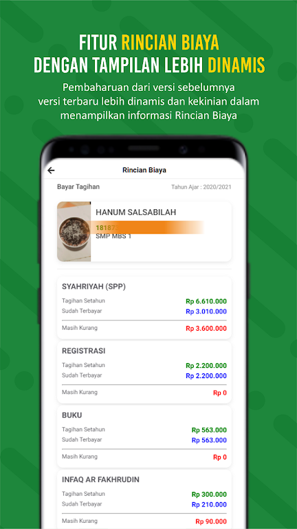
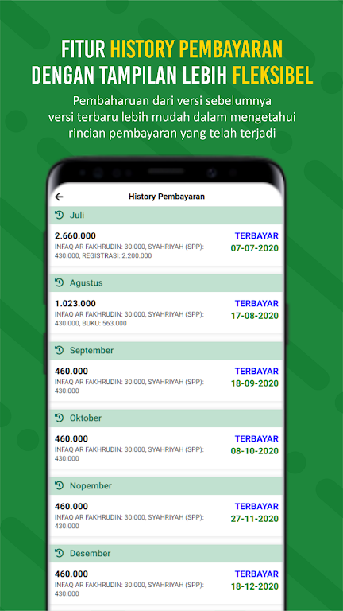

# 📱 Aplikasi Bank Mini Santri

Aplikasi mobile untuk membantu santri dan wali memonitor tagihan bulanan, saldo uang saku elektronik, dan riwayat transaksi secara mandiri. Dibuat untuk mendukung sistem manajemen keuangan modern di lingkungan pesantren.

---

## 🔧 Teknologi yang Digunakan

- Flutter
- REST API
- PHP (Backend Web)
- MySQL
- CORS

---

## ✨ Fitur Utama

- ✅ Menampilkan tagihan bulanan masing-masing santri
- ✅ Menampilkan petunjuk dan metode pembayaran
- ✅ Menampilkan saldo uang saku elektronik santri
- ✅ Menampilkan riwayat pembayaran tagihan
- ✅ Menampilkan riwayat penggunaan uang saku

---

## 👨‍💻 Peran Saya

**Fullstack Developer**  
Frontend: Flutter  
Backend: PHP  
Database: MySQL

---

## 🚧 Tantangan & Solusi

**Tantangan:**  
Digunakan oleh lebih dari **3000 santri** secara bersamaan yang membutuhkan performa tinggi dan akses cepat.

**Solusi:**  
Mengoptimalkan server dengan arsitektur **multi-core**, memaksimalkan efisiensi proses backend untuk scaling horizontal ringan.

---

## 📷 Screenshot Aplikasi

Berikut adalah beberapa tampilan dari aplikasi Bank Mini Santri:

#### 🏠 Dashboard

#### 🧾 Tagihan Bulanan

#### 📚 History Pembayaran

#### 🧭 Panduan Pembayaran

#### 💳 Dompet Uang Saku

#### 📰 Berita & Informasi Santri

---

## 📌 Catatan

Proyek ini bersifat **private** dan digunakan oleh klien untuk operasional keuangan santri di **Muhammadiyah Boarding School**, **Yogyakarta, Indonesia**.
