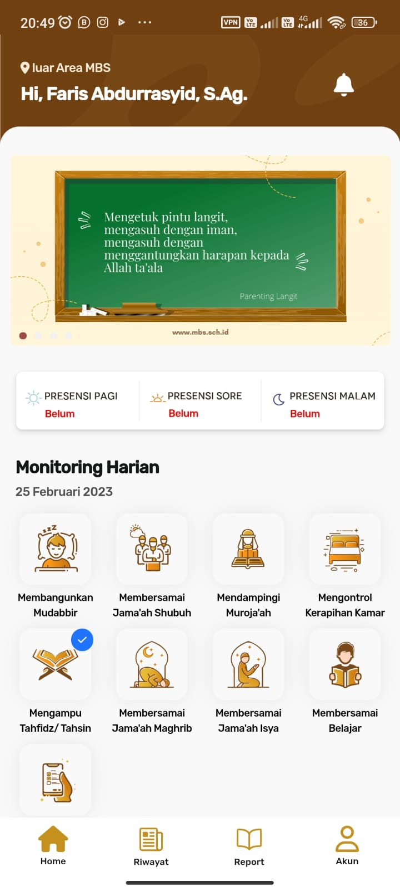
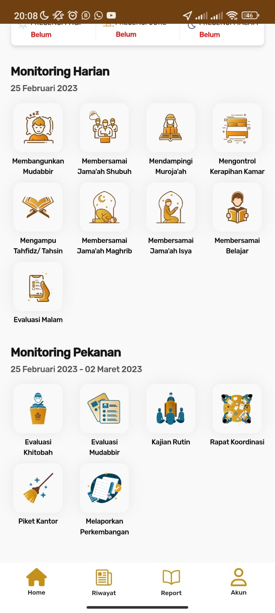
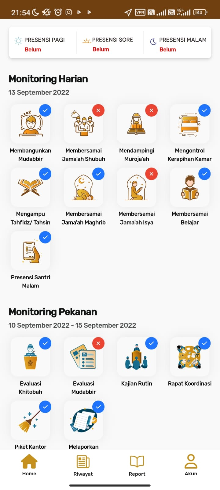

# 📱 Aplikasi Monitoring Kinerja Pembina

Aplikasi mobile yang dirancang untuk memantau aktivitas harian para pembina di lingkungan pondok pesantren. Pembina dapat melakukan presensi, melaporkan pelaksanaan tugas, serta memberikan laporan kondisi santri secara real-time.

---

## 🔧 Teknologi yang Digunakan

- Flutter
- REST API
- PHP (Backend Web)
- MySQL
- CORS

---

## ✨ Fitur Utama

- ✅ Presensi pembina 3x sehari (pagi, siang, malam) berdasarkan GPS + foto
- ✅ Pelaporan tugas harian pembina sesuai jadwal
- ✅ Upload bukti foto untuk tiap tugas
- ✅ Presensi santri harian + laporan masalah santri
- ✅ Update kondisi kesehatan santri ke tim medis pondok

---

## 👨‍💻 Peran Saya

**Fullstack Developer**  
Frontend: Flutter  
Backend: PHP  
Database: MySQL

---

## 📷 Screenshot Aplikasi

Berikut adalah beberapa tampilan dari aplikasi Monitoring Kinerja Pembina:

#### 🚀 Splash Screen

#### 🔐 Halaman Login

#### 🏠 Dashboard Pembina

#### 📂 Menu Utama

#### 📋 Aktivitas Harian Pembina

---

## 📌 Catatan

Proyek ini bersifat **private** dan digunakan oleh klien untuk operasional harian di **Muhammadiyah Boarding School** di kota **Yogyakarta, Indonesia**.
