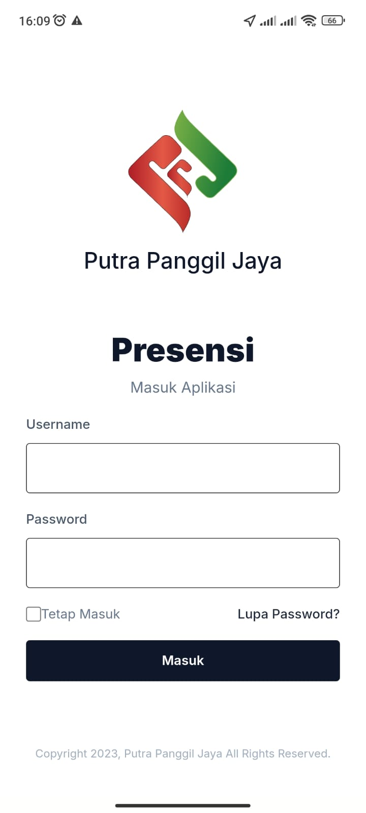
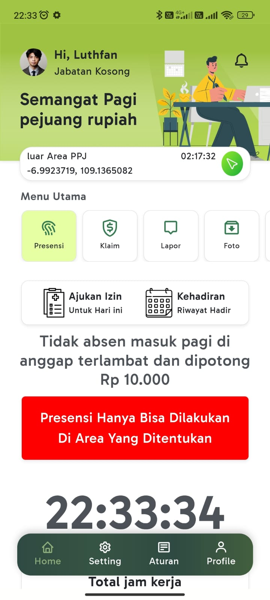
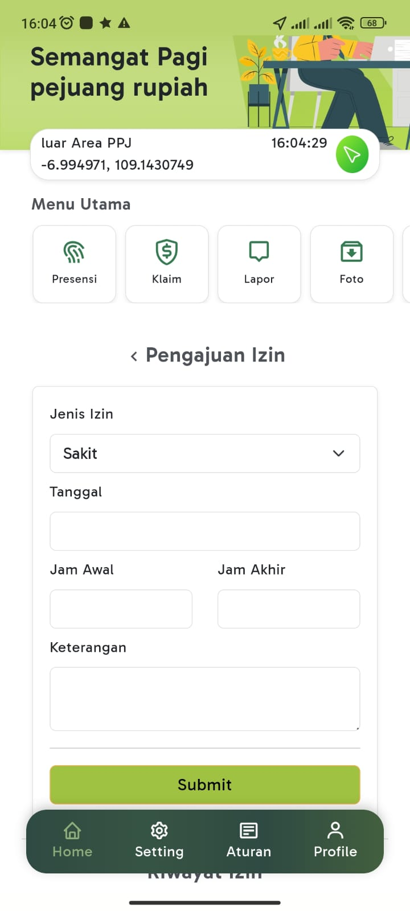
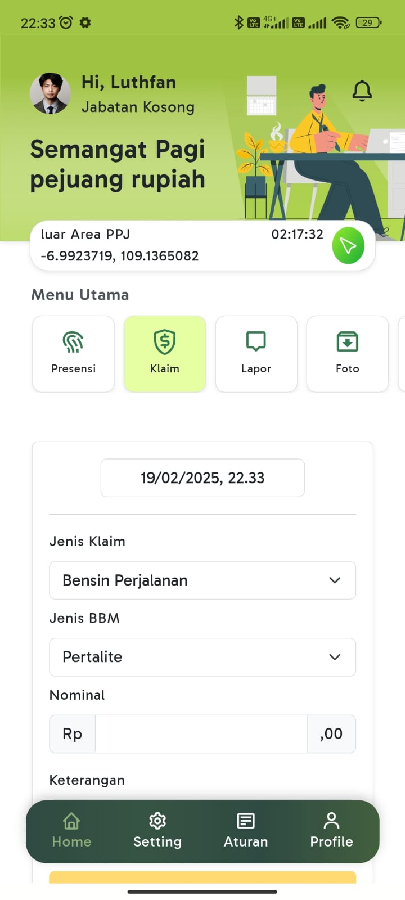
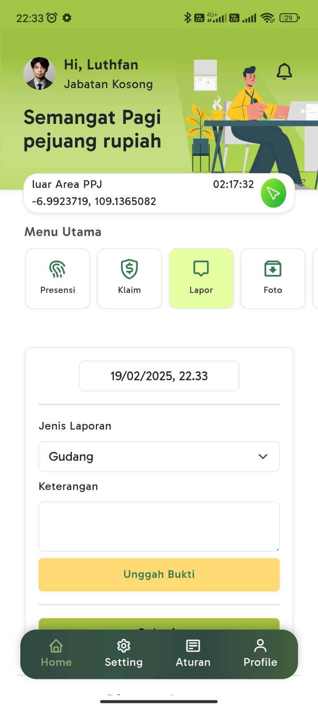
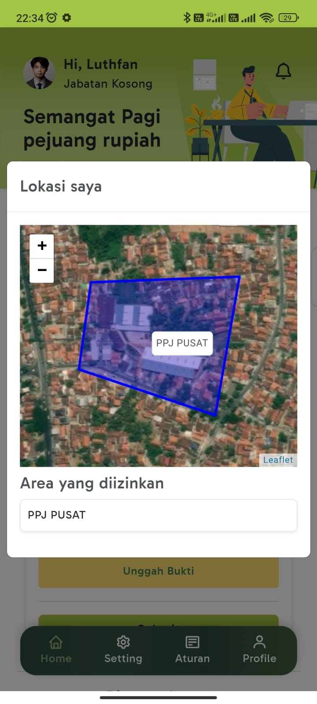
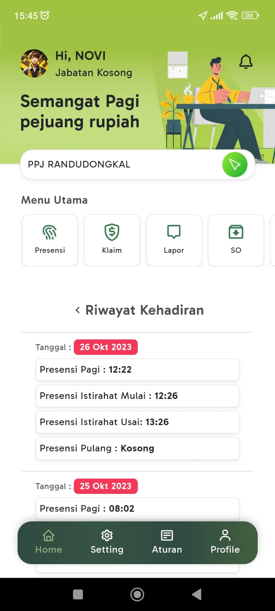

# 📱 Aplikasi Presensi Pegawai

Aplikasi mobile untuk melakukan presensi harian pegawai berdasarkan lokasi cabang masing-masing. Dilengkapi dengan fitur laporan operasional dan klaim nota pengeluaran toko secara mandiri.

---

## 🔧 Teknologi yang Digunakan

- Flutter
- REST API
- Node.js + Express.js
- MySQL
- JWT (JSON Web Token)
- CORS

---

## ✨ Fitur Utama

- ✅ Presensi hanya bisa dilakukan di area cabang sesuai lokasi yang ditentukan
- ✅ Menampilkan history presensi harian
- ✅ Laporan kondisi toko oleh pegawai
- ✅ Klaim pengeluaran toko (listrik, air, servis, dll) dengan upload bukti
- ✅ Perizinan ketidakhadiran via aplikasi (dengan upload bukti izin)

---

## 👨‍💻 Peran Saya

**Fullstack Developer**  
Frontend: Flutter  
Backend: Node.js + Express.js  
Database: MySQL

---

## 📷 Screenshot Aplikasi

Berikut adalah beberapa tampilan dari aplikasi Presensi Pegawai:

#### 🔐 Halaman Login

#### 🏠 Dashboard Pegawai

#### 📝 Form Perizinan Tidak Hadir

#### 💵 Form Klaim Nota

#### 📋 Laporan Kondisi Toko

#### 📍 Presensi Pegawai Berdasarkan Lokasi GPS

#### 📆 History Presensi Harian

---

## 📌 Catatan

Proyek ini bersifat **private** dan digunakan oleh klien untuk operasional harian seluruh pegawai cabang distribusi nasional **Putra Panggil Jaya** di kota **Tegal, Indonesia**.
