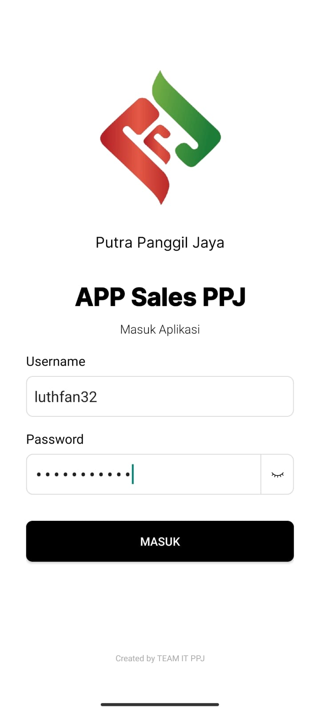
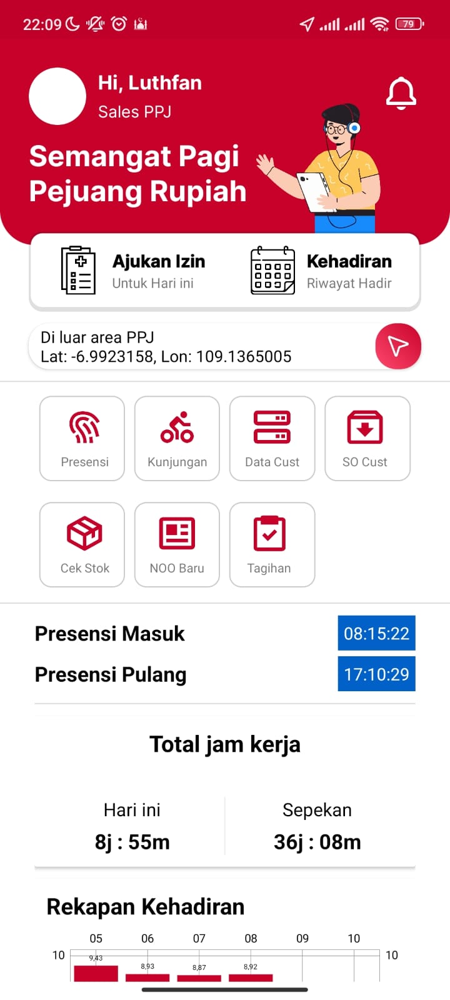
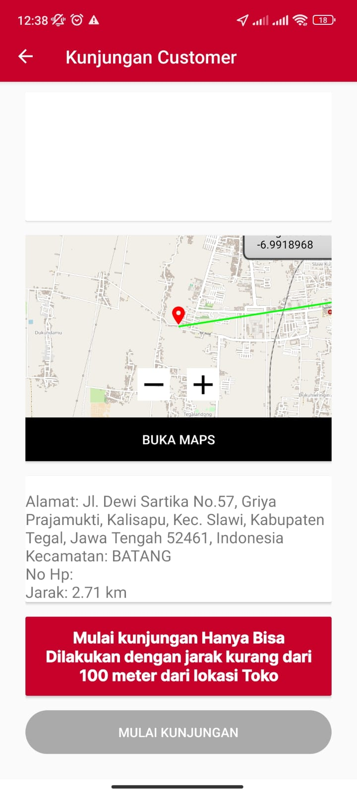

# 📱 Aplikasi Sales PPJ

Aplikasi mobile untuk manajemen sales, membantu tim sales dalam mencatat dan melaporkan stok barang di toko cabang secara real-time, serta melakukan pemesanan barang langsung dari aplikasi untuk dikirim ke pelanggan.

---

## 🔧 Teknologi yang Digunakan

- Flutter
- REST API
- Node.js + Express.js
- SQL Server & MySQL
- JWT (JSON Web Token)
- CORS

---

## ✨ Fitur Utama

- ✅ Login dengan autentikasi token
- ✅ Presensi dengan akurasi lokasi (GPS) sesuai titik cabang
- ✅ Pendaftaran pelanggan baru oleh sales
- ✅ Kunjungan ke pelanggan & update stok
- ✅ Melihat stok gudang secara real-time
- ✅ Pelaporan kondisi khusus dari lapangan
- ✅ Melakukan order pelanggan langsung dari aplikasi

---

## 👨‍💻 Peran Saya

**Fullstack Developer**  
Frontend: Flutter  
Backend: Node.js + Express.js  
Database: SQL Server & MySQL

---

## 🚧 Tantangan & Solusi

**Tantangan:**  
Banyak user lapangan berada di lokasi tanpa koneksi internet.

**Solusi:**  
Implementasi local database dengan sinkronisasi otomatis di background menggunakan sistem queue. Data akan tersimpan sementara lalu dikirim ke server ketika koneksi tersedia.

---

## 📷 Screenshot Aplikasi

> Upload gambar-gambar berikut ke folder `screenshots/` dalam repo.

#### 🔐 Login Page

#### 🔐 Dashboard Page

#### 📦 Form Kunjungan Pelanggan

#### 🧾 Daftar Pelanggan & Update Stok

#### 📍 Presensi dengan Lokasi GPS

*(Silakan ganti nama file di atas dengan nama gambar kamu yang sebenarnya)*

---

## 📌 Catatan

Proyek ini bersifat **private** dan digunakan oleh klien untuk operasional harian perusahaan distribusi nasional **Putra Panggil Jaya** di kota **Tegal, Indonesia**.
