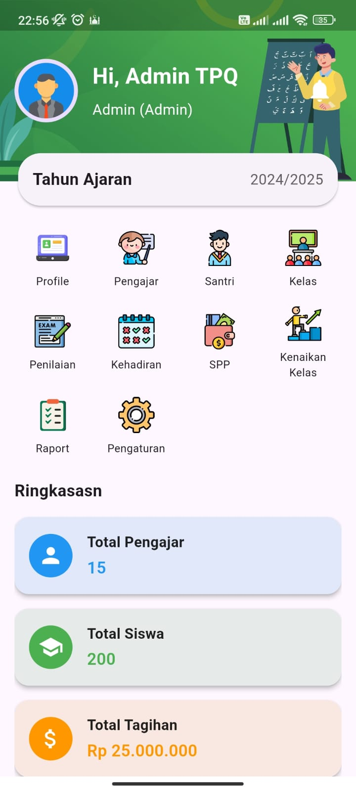
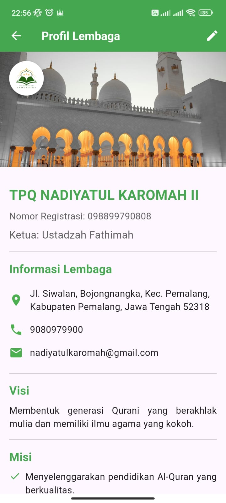
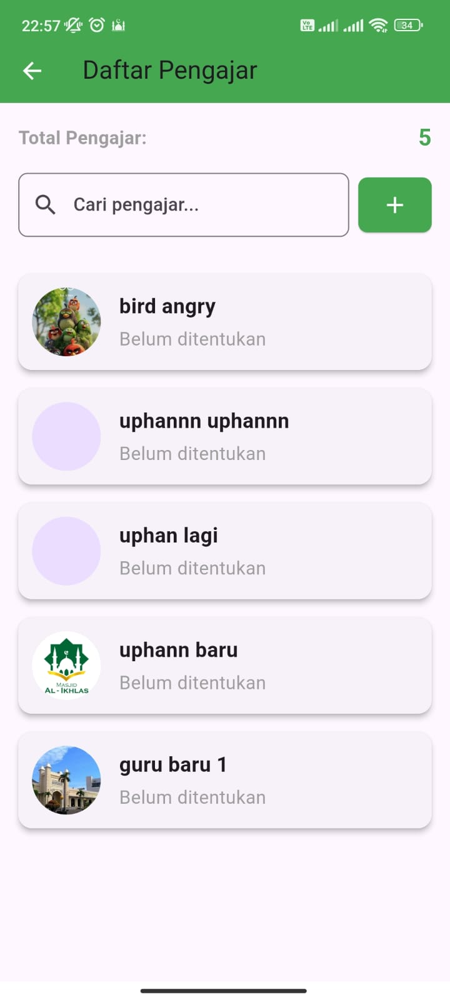
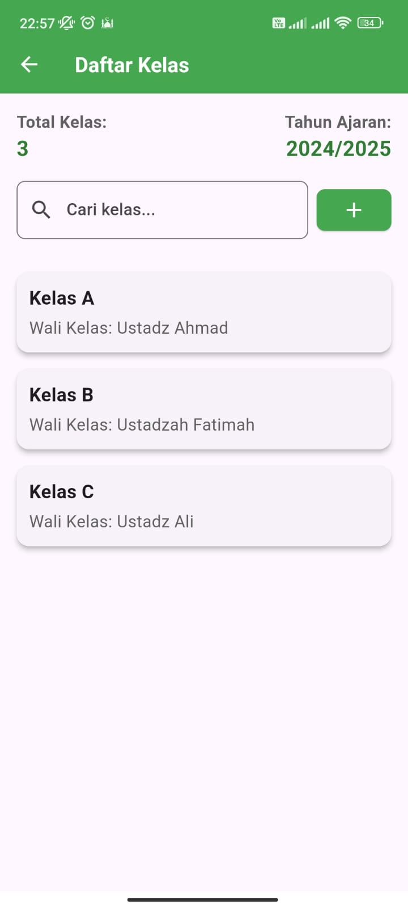
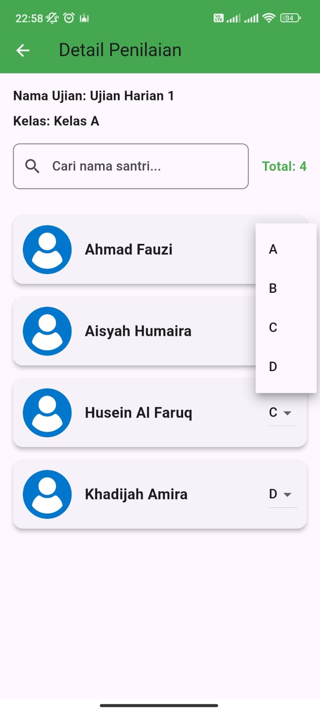

# 📱 Aplikasi TPQ Master

Aplikasi mobile untuk manajemen kegiatan belajar-mengajar santri dan guru di lembaga pendidikan TPQ. Fitur-fitur mencakup pendataan, keuangan, presensi, dan pelaporan perkembangan santri secara menyeluruh.

---

## 🔧 Teknologi yang Digunakan

- Flutter
- REST API
- Node.js + Express.js
- MySQL
- JWT (JSON Web Token)
- CORS

---

## ✨ Fitur Utama

- ✅ Pendataan lengkap santri dan guru
- ✅ Manajemen kelas dan wali kelas
- ✅ Pencatatan dan penagihan SPP santri
- ✅ Presensi harian santri
- ✅ Pembuatan raport perkembangan santri
- ✅ Penilaian ujian santri

---

## 👨‍💻 Peran Saya

**Fullstack Developer**  
Frontend: Flutter  
Backend: Node.js + Express.js  
Database: MySQL

---

## 📷 Screenshot Aplikasi

Berikut adalah beberapa tampilan dari aplikasi TPQ Master:

#### 🔐 Halaman Login

#### 🏠 Dashboard

#### ⚙️ Pengaturan & Info Sekolah

#### 🧒 Manajemen Santri

#### 👨‍🏫 Manajemen Guru

#### 🏫 Manajemen Kelas

#### 📅 Presensi Santri

#### 📝 Penilaian Ujian Santri

#### 📊 Raport Santri

#### 💰 Manajemen SPP

---

## 📌 Catatan

Proyek ini bersifat **private** dan digunakan oleh klien untuk kegiatan operasional harian di **TPQ swasta** di kota **Pemalang, Indonesia**.
