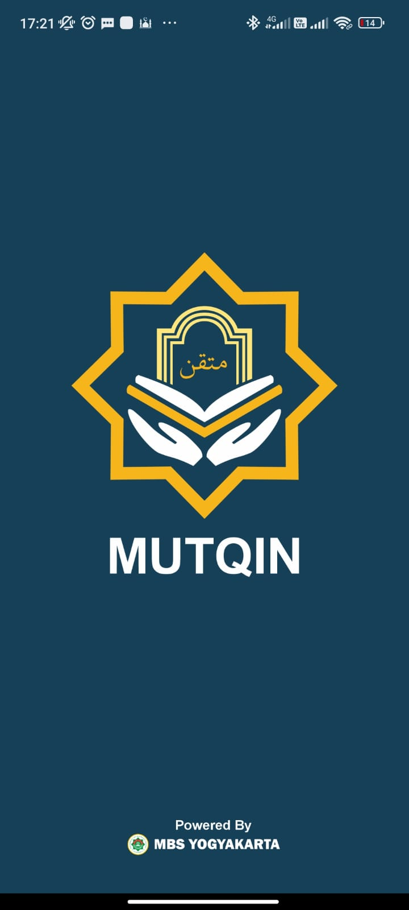
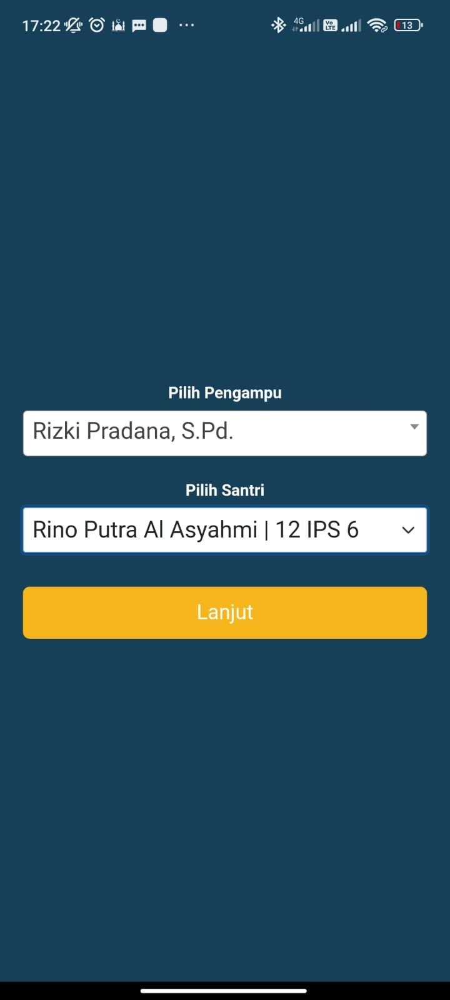
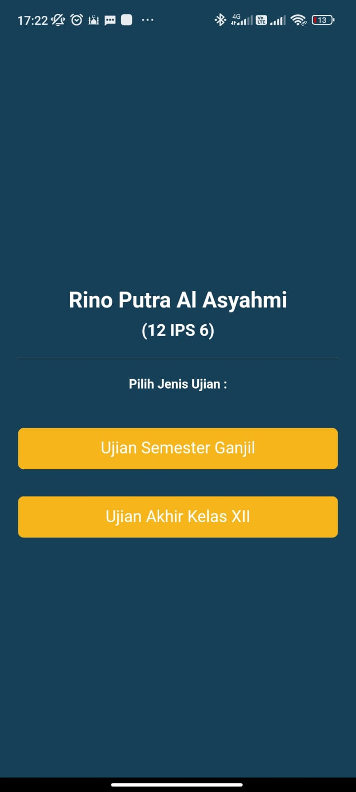
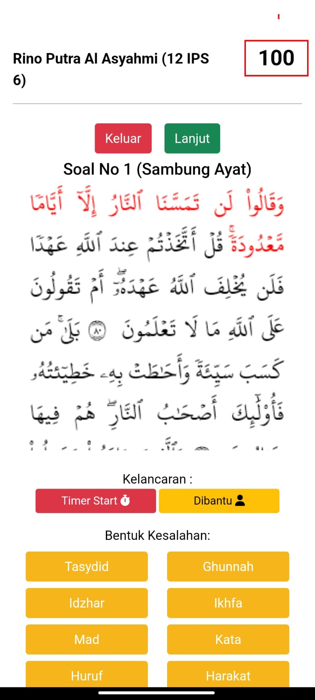
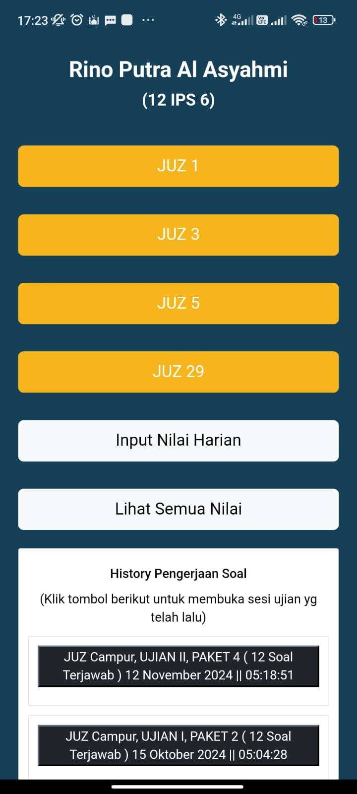

# 📱 Aplikasi Ujian Tahfidz

Aplikasi mobile yang memudahkan pengampu tahfidz dalam melakukan penilaian terhadap santri saat ujian hafalan Al-Qur'an. Terintegrasi dengan sistem penjadwalan dan pemilihan soal berbasis web.

---

## 🔧 Teknologi yang Digunakan

- Flutter
- REST API
- PHP (Backend Web)
- MySQL
- CORS

---

## ✨ Fitur Utama

- ✅ Pemilihan santri yang terdaftar untuk ujian tahfidz
- ✅ Pemilihan paket soal ujian yang telah diatur melalui sistem web
- ✅ Penilaian hafalan santri melalui tampilan tombol interaktif
- ✅ Menampilkan history penilaian santri sebelumnya

---

## 👨‍💻 Peran Saya

**Fullstack Developer**  
Frontend: Flutter  
Backend: PHP  
Database: MySQL

---

## 📷 Screenshot Aplikasi

Berikut adalah beberapa tampilan dari aplikasi Ujian Tahfidz:

#### 🚀 Splash Screen

#### 👤 Login

#### 👤 Pemilihan Santri

#### 🗂️ Pilihan Paket Soal

#### ✅ Penilaian Ujian Tahfidz

#### 📊 History Penilaian

---

## 📌 Catatan

Proyek ini bersifat **private** dan digunakan oleh klien untuk operasional harian di **Muhammadiyah Boarding School** di kota **Yogyakarta, Indonesia**.
